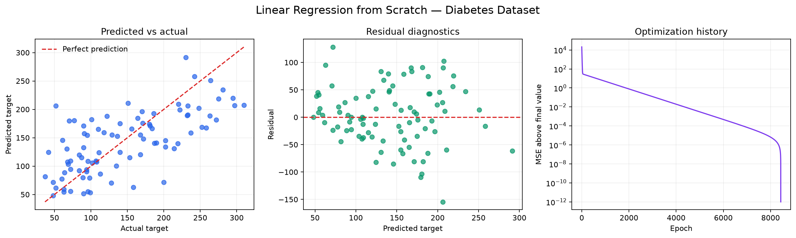
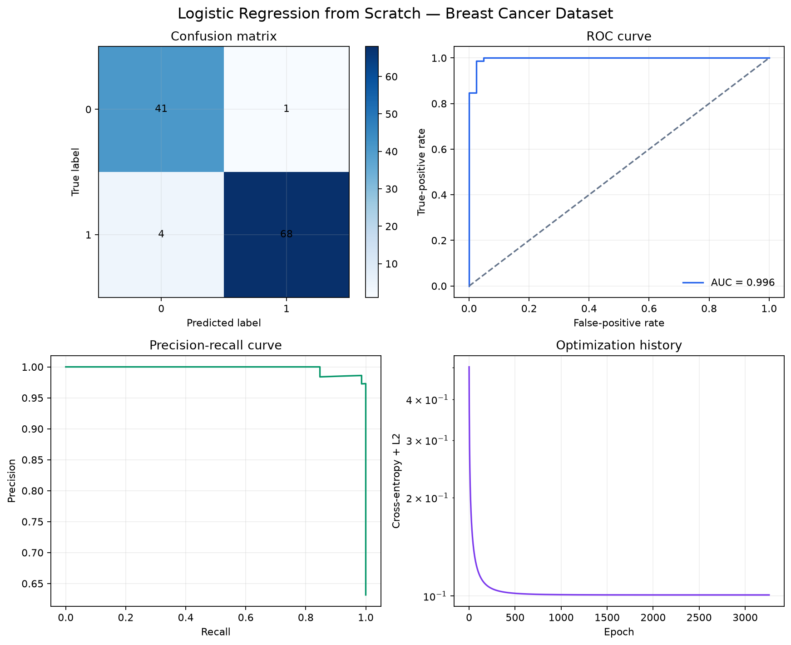
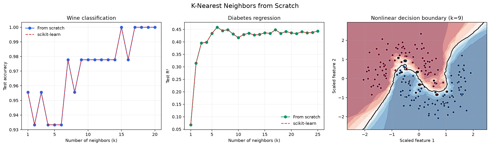

# Machine Learning from Scratch

Implementations of machine-learning algorithms using NumPy for the underlying
math. External ML libraries may be used in examples for datasets, data splitting,
and comparison, but not to implement the models themselves.

## Implemented algorithms

- Linear regression
  - Numerically stable least-squares solution
  - Batch, mini-batch, and stochastic gradient descent
  - Early stopping and convergence diagnostics
  - Optional L2 regularization
  - R-squared scoring
- Logistic regression
  - Binary classification with arbitrary target labels
  - Batch, mini-batch, and stochastic gradient descent
  - Numerically stable sigmoid and cross-entropy
  - Optional L2 regularization
  - Early stopping and convergence diagnostics
  - Balanced or custom class weights
  - Decision scores, probabilities, and configurable classification threshold
- K-nearest neighbors
  - Classification and regression
  - Uniform and inverse-distance weighting
  - Euclidean, Manhattan, and configurable Minkowski distance
  - Multiclass probabilities and direct neighbor inspection
- Evaluation metrics
  - Regression: MSE, RMSE, MAE, MAPE, R-squared, and adjusted R-squared
  - Classification: accuracy, confusion matrix, precision, recall, and F1
  - Probability metrics: log loss, ROC-AUC, ROC curve, and precision-recall curve
  - Explicit behavior for undefined divisions and zero-valued MAPE targets
- Preprocessing
  - Standard scaling with optional centering and variance scaling
  - Min-max scaling with custom ranges and optional clipping
  - Inverse transforms and safe handling of constant features

Each model follows a small `fit`/`predict` interface. Tests can be run from the
repository root after creating the project environment:

```bash
uv sync
```

Run commands inside the environment without manually activating it:

```bash
uv run python -m unittest discover -p "test_*.py" -v
```

## Linear regression example

```python
from linear_regression import GradientDescentLR

model = GradientDescentLR(
    lr=0.05,
    n_iters=2_000,
    tolerance=1e-10,
    batch_size=32,
    l2=0.01,
    random_state=42,
)
model.fit(X_train, y_train)

predictions = model.predict(X_test)
print(model.coef_, model.intercept_)
print(model.score(X_test, y_test))
print(model.n_iters_, model.converged_)
```

The tests compare the from-scratch implementations with scikit-learn for
verification; scikit-learn is not used by the model implementations.

## Reproducible demos

The demos use datasets bundled with scikit-learn, so no manual downloads or API
keys are required:

```bash
uv run python -m demos.linear_regression_demo
uv run python -m demos.logistic_regression_demo
uv run python -m demos.knn_demo
```

Each command prints a held-out comparison with scikit-learn and saves diagnostic
plots under `artifacts/`.

### Linear regression diagnostics



### Logistic regression diagnostics



### K-nearest-neighbors diagnostics


